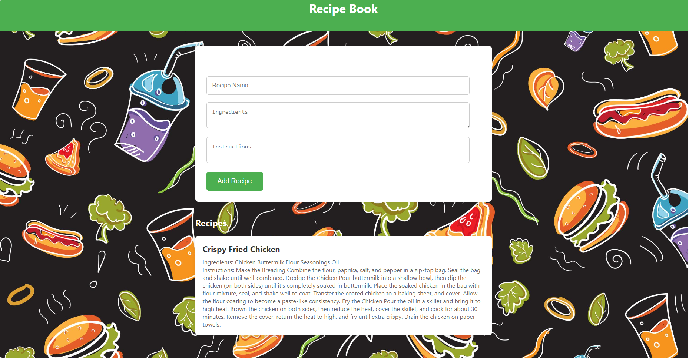

# Recipe Book by Kirk Caspe

Welcome to Recipe Book, a simple web application where you can manage and store your favorite recipes!

## Description

Recipe Book allows you to add, view, and manage recipes easily. Simply enter the name of the recipe, its ingredients, and instructions, and the app will organize them for you. It's a handy tool for keeping track of your culinary creations!

## Features

- Add new recipes with names, ingredients, and instructions.
- View a list of all added recipes.
- Clean and intuitive user interface.
- Modern styling for an attractive appearance.

## Usage

1. Clone the repository to your local machine.
2. Open the `index.html` file in your web browser.
3. Use the "Add Recipe" section to input the details of your recipes.
4. Click the "Add Recipe" button to add the recipe to your Recipe Book.
5. View the list of added recipes in the "Recipes" section.

## Technologies Used

- HTML
- CSS
- JavaScript
- ES6 Modules
- Parcel.js (for bundling modules)
- GreenSock Animation Platform (optional, for enhanced animations)

## Project Structure

- `index.html`: Main HTML file for the Recipe Book app.
- `css/main.css`: CSS file for styling the app.
- `js/main.js`: JavaScript file for the main functionality of the app.
- `js/recipebook.js`: JavaScript file containing the RecipeBook class.

## Screenshots

## Credits

This project was created by me Kirk Caspe. It may contain code snippets or design elements inspired by other sources, and credits are given where appropriate.

## License

This project is licensed under the MIT License. See the [LICENSE](LICENSE) file for details.
